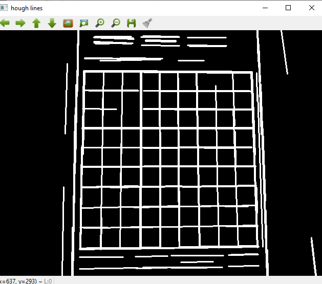
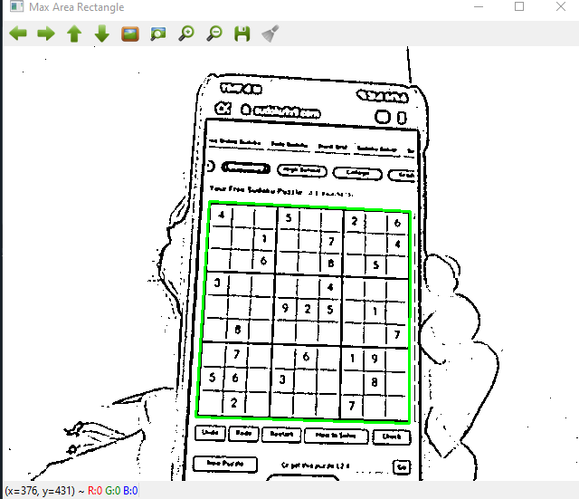
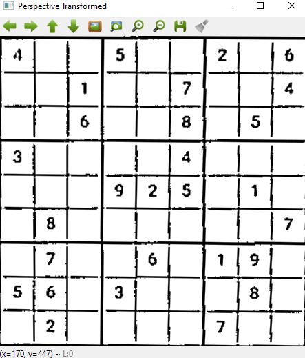
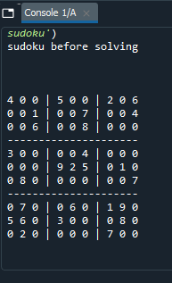
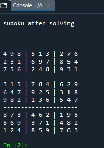
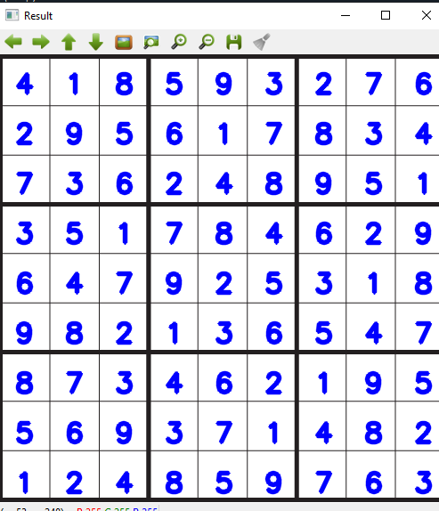

# Real Time Sudoku Solver
Solving sudoku Realtime with the help of **Computer Vision** , **Backtracking Algorithm** and **Artifictial Intelligence**

## Introduction 

Sudoku is one of the most popular puzzles. The goal of sudoku is to place the numbers one through nine exactly once in each row, column, and 9x9 box based on the starting numbers that are already filled in and any subsequent numbers you fill in. In this project, we aim to create a real-time sudoku solver which recognizes the sudoku grids and provide solution with the help of Computer Vision.

## Prerequisites

### Python 

Python version 3.7.7 is used in this project.

### OpenCV

OpenCV is a cross-platform library using which we can develop real-time computer vision applications. It mainly focuses on image processing, video capture and analysis including features like face detection and object detection.

To install opencv:
- In Linux: ``` pip install opencv-python```
- In Conda environment: ``` conda install -c conda-forge opencv ```

### Python-tesseract
Python-tesseract is an optical character recognition (OCR) tool for python. That is, it will recognize and “read” the text embedded in images.Python-tesseract is a wrapper for Google’s Tesseract-OCR Engine.

To install opencv:
- In Linux: ```pip install pytesseract ```
- In conda environment: ``` conda install -c conda-forge tesseract ```

Python-tesseract requires path to be set, if you are like me who couldnt set the path during installation. Then find where your tesseract.exe file is and then copy that path and paste it on webcam_main.py file ```pytesseract.pytesseract.tesseract_cmd = r'yourpath' ``` instead of ```pytesseract.pytesseract.tesseract_cmd = r'C:\Program Files\Tesseract-OCR\tesseract.exe' ```. If you have set the path prior then comment out the ```pytesseract.pytesseract.tesseract_cmd = r'C:\Program Files\Tesseract-OCR\tesseract.exe'``` line in webcam_main.py file.

## Usage 

To run this project, follow the steps given below:

Clone the repository```https://github.com/Anjitha95/Real-time-sudoku.git```
Run the file  ```webcam_main.py```

## Steps

### Image Processing
The image is converted to grayscale and Adaptive Thresholding are applied to the image to reduce noise. Then the maximun area using hough lines and contouring is found which is assumed to be sudoku grid. 

<p align = "left"></p>
<p align = "center"></p>

### Wrapping
By the cordinates we found using contour and houghlines, we wrap the grid and extracts out the individual cells out of the sudoku grid.
<p align = "center"></p>

### Digit Recognization
Here the individual cell images are passed to Python-tesseract (OCR) to recognize the image and to return the set of recoginzed image as string.which is then converted to a 2D array
<p align = "center"></p>

### Backtracking
The array of recognised image is feed to a backtracking algorithm to solve the sudoku and to print out the sudoku solution.
<p align = "center"></p>

### Overlaying Solution to an image
The solution is then overlayed on the empty sudoku grid image
<p align = "center"></p>

## References

- https://stackoverflow.com/
- https://towardsdatascience.com/open-cv-based-sudoku-solver-powered-by-rust-df256653d5b3
- https://medium.com/@pmprakhargenius/sudoku-solver-ai-agent-700897b936c7
- https://www.youtube.com/
- https://github.com/manpreet1130/RealTime-Sudoku-Solver

And many more........

## Issues to solve

1. There exists a lag while capturing and contoring the image
2. When sudoku is not solvable it is gives back the same unsolved array as the result.
3. The solver cannot understand whether the shown grid is already solved or not, so it solves each time a sudoku is shown.

## Future Development  
1. Augmented reality
